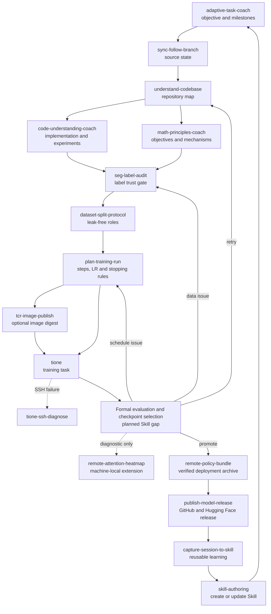

# Personal Codex Skill Architecture

This repository is the portable, privacy-filtered backup of a personal Codex Skill library. It stores reusable workflows, deterministic scripts, focused references, and the manifest needed to restore the library on another machine.

See the generated [Skill Usage Dashboard](SKILLS.md) for each exported Skill and its usage count.

It intentionally does **not** back up Codex sessions, authentication state, tokens, private keys, plugin caches, runtime `config.json` files, or machine-private references.

## Design principles

- Keep one clear responsibility per Skill.
- Use a thin orchestrator to compose specialist Skills instead of creating one large all-purpose Skill.
- Pass manifests, hashes, revisions, task IDs, metrics, and verified artifacts between phases—not conversational conclusions.
- Treat explanation, planning, external writes, holdout access, training launch, and publication as separate authorization boundaries.
- Preserve completed experiment evidence and start a new cycle when a failed result sends work back upstream.

## End-to-end architecture

`robot-ml-lifecycle` is the control plane. It owns lifecycle phase state and handoffs while delegating domain decisions to the corresponding specialist.



Machine-bound Skills may be excluded by the local privacy configuration. `remote-attention-heatmap` is represented in the architecture because it participates in the local workflow, but it is not part of the current portable export.

## Skill groups

### Control and knowledge retention

| Skill | Responsibility |
|---|---|
| `robot-ml-lifecycle` | Coordinate the complete robot-ML lifecycle, phase gates, immutable experiment cycles, and handoffs. |
| `adaptive-task-coach` | Manage milestones, evidence, blockers, replanning, and the user's learning track. |
| `capture-session-to-skill` | Distill verified work into a reusable Skill and safely synchronize the library. |
| `skill-authoring` | Design, review, and improve Skill folders and trigger descriptions. |
| `andrej-karpathy-skills` | Keep code changes simple, surgical, assumption-aware, and verifiable. |

### Source and understanding

| Skill | Responsibility |
|---|---|
| `sync-follow-branch` | Preserve dirty Git work while synchronizing a follow branch. |
| `understand-codebase` | Map an unfamiliar repository and trace representative execution paths. |
| `code-understanding-coach` | Trace functions and tensors, make minimal changes, and verify experimentally. |
| `math-principles-coach` | Connect losses, probability, gradients, and train/inference behavior to code and experiments. |

### Domain knowledge and project guides

| Skill | Responsibility |
|---|---|
| `feishu-wiki-readonly-review` | Traverse nested Feishu Wiki/Docx trees read-only and synthesize versioned experiment evidence. |
| `psi-wam-learning-coach` | Join PSI WAM source paths, Flow Matching principles, Feishu pretraining lessons, and evaluation contracts into a progressive learning and experiment guide. |
| `psi-autolabel-service-guide` | Explain and maintain the PSI Autolabel FastAPI topology, task lifecycle, workers, and cross-node recovery boundaries. |
| `mj-demo-runtime-guide` | Trace the MJ-Demo Mahjong robot runtime across local perception, remote Brain/VLM calls, orchestration, review, and robot actions. |

### Data and training design

| Skill | Responsibility |
|---|---|
| `seg-label-audit` | Freeze segmentation-label semantics and produce quarantine/valid-frame manifests. |
| `dataset-split-protocol` | Build grouped, exposure-aware, leak-free train/val/diagnostic/holdout roles. |
| `plan-training-run` | Convert dataset size and batch configuration into steps, schedules, cadence, and stopping rules. |

### Infrastructure and execution

| Skill | Responsibility |
|---|---|
| `tcr-image-publish` | Transfer, hash-verify, and publish Docker/OCI images to Tencent Cloud TCR. |
| `tione` | Inspect and operate TI-ONE training tasks, notebooks, resources, logs, and service payloads. |
| `tione-ssh-diagnose` | Separate endpoint, network, host-key, and user-key SSH failures. |

### Artifacts and release

| Skill | Responsibility |
|---|---|
| `remote-policy-bundle` | Export remote checkpoints into verified, self-contained deployment archives. |
| `publish-model-release` | Bind GitHub source and Hugging Face artifacts into a reproducible model release. |

## Handoff spine

The intended durable handoffs are:

```text
Git commit
  → label decision / quarantine / valid-frame manifests
  → role manifests + exposure ledger + split hashes
  → resolved training plan + config hash
  → image digest + TI-ONE task/instance IDs
  → checkpoint provenance + evaluation manifest
  → deployment bundle manifest + archive SHA256
  → GitHub commit + Hugging Face revision + model file hashes
  → captured reusable workflow or failure mode
```

The lifecycle ledger records these identities without duplicating the specialist Skills' internal procedures.

## Missing Skill roadmap

These names describe planned responsibilities; they are not installed Skills yet.

### P0 — required to close the scientific loop

1. **`evaluate-policy-run`**
   - run a frozen evaluation contract over multiple checkpoints;
   - bind dataset revision, split, preprocessing, metrics, raw/EMA role, and runtime validity;
   - compare checkpoints using a declared rule;
   - emit `evaluation_manifest.json` and a promote/retry/stop decision.

2. **`robot-dataset-audit`**
   - validate observation/action schemas, units, ranges, coordinate frames, and episode completeness;
   - detect missing/duplicate frames, timestamp drift, camera ordering, sensor/action latency, and normalization problems;
   - emit a dataset-integrity gate before splitting or training.

### P1 — required for reliable model decisions

3. **`evaluate-policy-rollout`**
   - run simulation or real-robot closed-loop evaluation;
   - record success rate, safety stops, control frequency, latency, recovery behavior, failure taxonomy, videos, and trajectories;
   - preserve diagnostic versus sealed-holdout exposure rules.

4. **`monitor-training-run`**
   - monitor loss, gradient, LR, throughput, GPU health, NaN/divergence, checkpoint production, and overfitting;
   - compare runs against the frozen plan;
   - produce evidence-backed stop, extend, or restart recommendations.

### P2 — deployment and long-term operations

5. **`deploy-policy-runtime`**
   - deploy a verified bundle to a robot or inference service;
   - validate runtime contracts, ONNX/TensorRT variants, health checks, canary/shadow rollout, version identity, and rollback.

6. **`manage-ml-artifacts`**
   - enforce retention policies for checkpoints, bundles, logs, heatmaps, caches, and datasets;
   - audit references and costs before any deletion;
   - coordinate local, TI-ONE, object-storage, TCR, and Hugging Face copies.

Create a roadmap Skill only after the underlying workflow has been executed often enough to provide real commands, manifests, failure modes, and acceptance evidence. Avoid speculative Skills that contain only generic advice.

## Repository layout

```text
skills/
  <skill-name>/
    SKILL.md
    agents/openai.yaml
    scripts/       # deterministic operations, when needed
    references/    # detailed contracts and runbooks, loaded on demand
    assets/        # reusable output templates, when needed
skills-manifest.json
README.md
```

`skills-manifest.json` tracks portable Skills and usage metadata. Runtime configuration remains local and is recreated from `config.example.json` after restoration.
